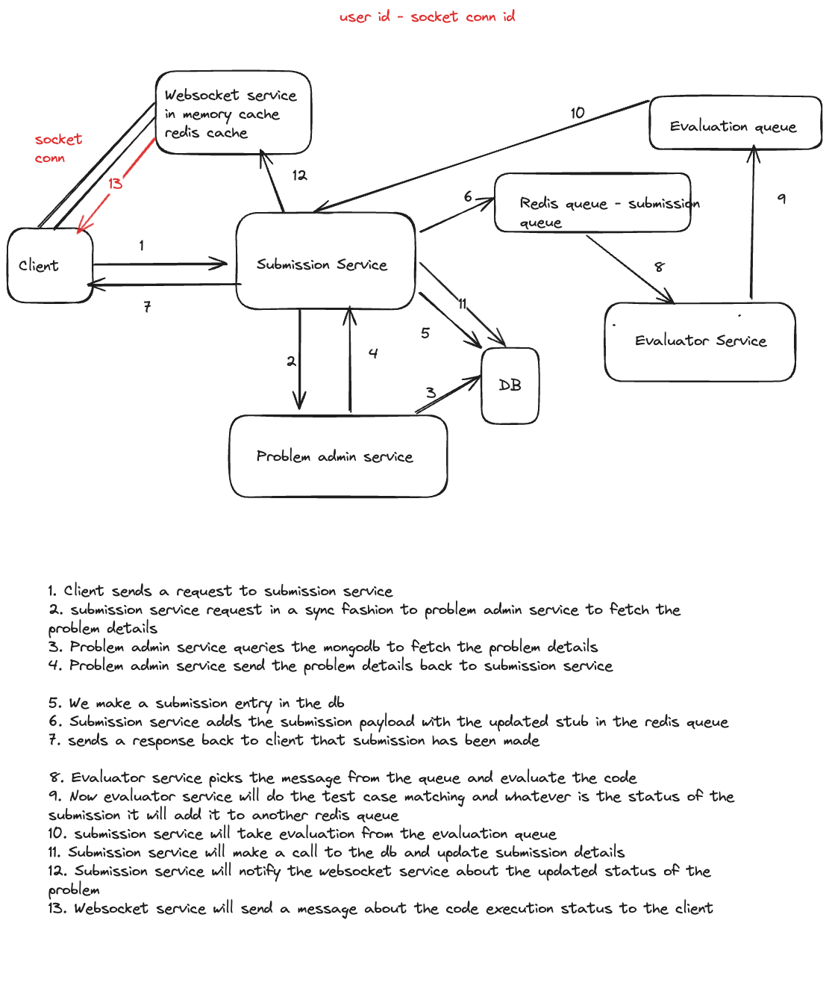
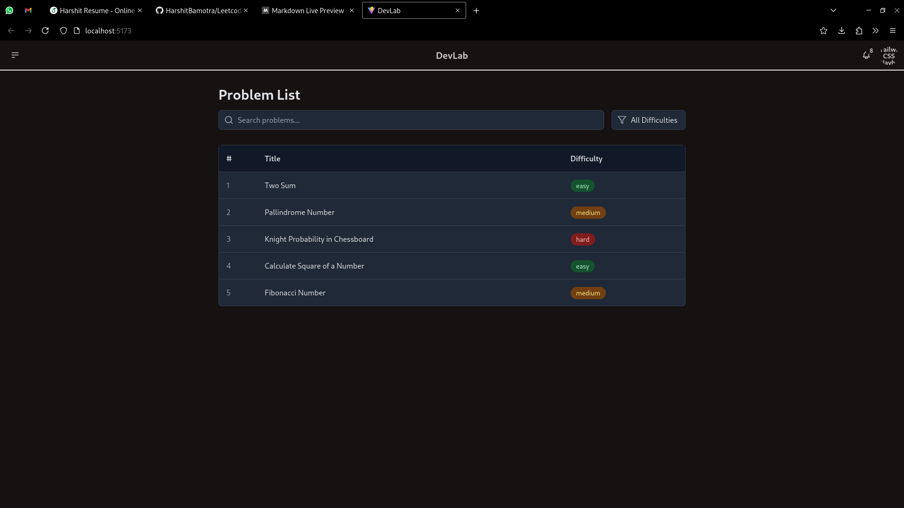
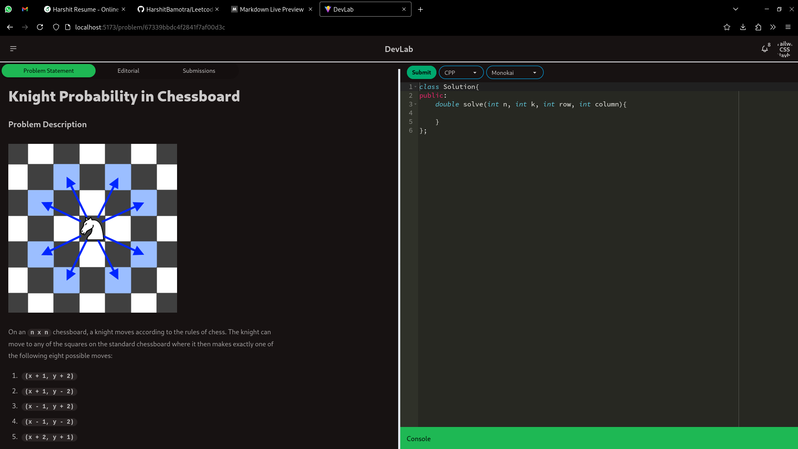
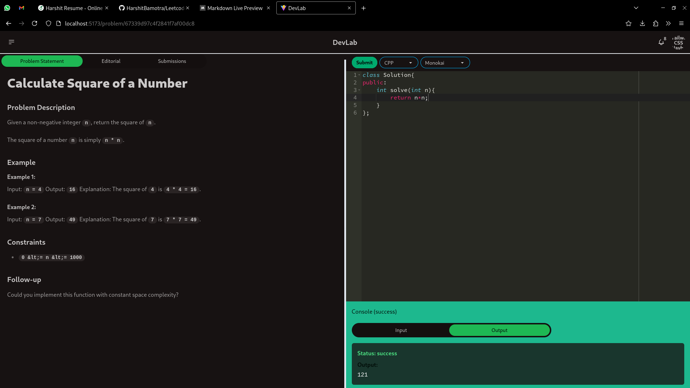

# LEETCODE CLONE - Microservices Architecture

## Overview

This project is a Leetcode-like application that allows users to submit coding solutions to problems, which are then evaluated and returned with results in real-time. The architecture is built on microservices, each responsible for a specific function in the workflow. 

The services are designed to communicate through message queues to handle submissions, evaluations, and real-time feedback, ensuring a seamless user experience. The microservices involved are:

1. **Problem Service**: Manages and provides problem data. (CRUD problems)
2. **Submission Service**: Handles user submissions and coordinates processing.
3. **Evaluation Service**: Evaluates the submitted code in a secure environment.
4. **Socket Service**: Provides real-time updates to the frontend.
5. **Frontend**: The user interface where users interact with the platform.

## Architecture and Workflow



## Microservices Overview

### 1. Problem Service
- **Function**: Stores and serves coding problems and their metadata.
- **Endpoints**:
  - `GET /api/v1/problems/`: Retrieves a list of problems.
  - `GET /api.v1/problems/:id`: Retrieves details of a specific problem.
  - `POST /api/v1/problems/`: Adds a problem.
  - `PATCH /api.v1/problems/:id`: Updates details of a specific problem.
  - `DELETE /api.v1/problems/:id`: Deletes a specific problem.

### 2. Submission Service
- **Function**: Manages user submissions and coordinates processing.
- **Endpoints**:
  - `POST /api/v1/submissions`: creates a code submission.
- **Queues**:
  - `submissionQueue`: Sends submissions to the Evaluation Service.
  - `evaluationQueue`: Receives evaluation results and forwards them to the Socket Service.

### 3. Evaluation Service
- **Function**: Securely evaluates user-submitted code in a Docker container.
- **Process**:
  - Picks up submissions from the `submissionQueue`.
  - Runs the code against test cases.
  - Publishes results to the `evaluationQueue`.

### 4. Socket Service
- **Function**: Provides real-time updates to the client.
- **Process**:
  - Listens to the `evaluationQueue` for completed evaluations.
  - Uses WebSockets to push results to the client instantly.

### 5. Frontend
- **Function**: Provides an interactive interface for users to view problems, submit solutions, and see results.
- **Technologies**: React, WebSockets for real-time communication.

## Installation and Setup

### 1. Clone the repository:
```bash
git clone https://github.com/HarshitBamotra/Leetcode-Project.git
```
### 2. Change directory
```bash
cd Leetcode-Project
```
### 3. Install Dependencies
```bash
cd leetcode-submission-service
npm i

cd ../leetcode-evaluator-service
npm i

cd ../leetcode-problem-service
npm i

cd ../leetcode-socket-service
npm i

cd ../leetcode-frontend
npm i
```

### 4. Set up environment variables

for `leetcode-submission-service`, `leetcode-problem-service`, and `leetcode-evaluator-service`
create `.env` file in each directory

**Sample `.env` file for submission service**
```env
PORT = 3000

REDIS_PORT = 6379
REDIS_HOST = '127.0.0.1'

DB_URL = your mongodb url

PROBLEM_SERVICE_URL = "http://localhost:3001"

```

**Sample `.env` file for evaluator service**
```env
PORT = 3002
REDIS_PORT = 6379
REDIS_HOST = '127.0.0.1'
DOCKER_SOCKET_PATH = Your Docker Context (run docker context ls in terminal to find your path. eg: "/home/twobraincells/.docker/desktop/docker.sock") 
```

**Sample `.env` file for problem service**
```env
PORT = 3001
DB_URL = MongoDB URL
LOG_DB_URL = MongoDB URL
```

### 5. Install docker desktop from https://www.docker.com/products/docker-desktop/

### 6. Install Redis: https://redis.io/docs/latest/operate/oss_and_stack/install/install-redis/

### 7. Start the Application

```bash
cd leetcode-submission-service
npm start

cd ../leetcode-evaluator-service
npm start

cd ../leetcode-problem-service
npm start

cd ../leetcode-socket-service
npm start

cd ../leetcode-frontend
npm run dev
```

### 8. Access the Application at `localhost:5173/`

## PROJECT SCREENSHOTS

### Problem List Page



### Problem Description Page



### Problem Submission

